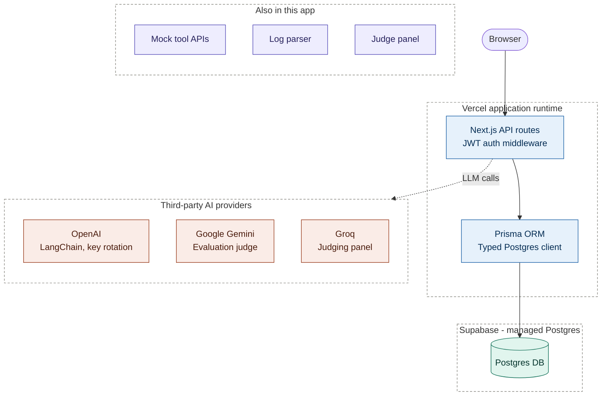

# Agentic Test Harness

A full-stack platform for testing, evaluating, and benchmarking autonomous AI agents. Upload agent run logs, parse them through an adapter-based ingestion pipeline, and evaluate agent performance using a multi-model LLM judging panel -- all from a single dashboard.

## Architecture



The primary request path is browser -> authenticated Next.js API routes -> Prisma -> Supabase Postgres. Dashed boxes are trust/deployment boundaries: the app's own runtime, Supabase's managed database, and the third-party LLM providers it calls out to. The mock tool catalog, log parser, and judging panel are other routes inside the same app, shown separately here just to keep the primary path readable.

## Tech Stack

| Layer | Technology |
|-------|-----------|
| Framework | Next.js 15 (App Router, Turbopack) |
| Language | TypeScript, React 19 |
| Database | PostgreSQL via Prisma ORM |
| Auth | Custom JWT-based auth (jose + bcrypt) |
| AI / LLM | Google Gemini 2.5 Flash (evaluation), Groq multi-model panel (judging), OpenAI / LangChain (test suite runs) |
| Storage | Local filesystem storage |
| Run Processing | In-process parser and judger modules |
| Styling | Tailwind CSS v4 |
| Validation | Zod v4 |
| Charts | Recharts |
| PDF Export | jsPDF + html2canvas |
| CI/CD | GitHub Actions (lint, test, build) + Vercel auto-deploy (production) + manual Docker/K8s deploy (self-hosted) + SonarQube Cloud scan (integrated, inactive until configured) |
| Containerization | Docker (multi-stage Node 20 Alpine), Kubernetes |

## Features

### Core Workflow

1. **Create Projects** -- Organize agent evaluations by project.
2. **Upload Agent Logs** -- Upload JSONL, JSON, or plain-text log files from agent runs.
3. **Parse Logs** -- An adapter-based ingestion pipeline auto-detects log formats (OpenAI Agents, LangChain, Public Data Trajectory, Generic JSONL) and extracts structured events, tool calls, steps, metrics, and rule flags.
4. **Judge Runs** -- A multi-model judging panel (6 free-tier Groq models) evaluates agent performance with median-based adjudication, confidence scoring, and per-dimension scorecards.
5. **Evaluate Runs** -- Gemini-powered evaluation scores runs across 7 dimensions on a 0-100 scale.
6. **Compare Runs** -- Select 2-4 runs for side-by-side comparison with delta indicators and dimension breakdowns.

### Interactive Test Harness

An in-browser test harness for running test suites with mock tools against OpenAI-compatible models. Includes a default "Tokyo Weekend Planner" scenario with 6 mock travel API endpoints (flights, hotels, weather, events, dining, budget).

### Custom Evaluation Rubrics

Define custom evaluation rubrics with configurable dimensions, weights, and scoring criteria. Three built-in templates (General AI Agent, Customer Service Agent, Code Generation Agent) are provided, or create your own from scratch.

### Model Budget Limits

Built-in budget validation prevents excessive API costs with configurable per-operation limits, real-time token/cost tracking, and HTTP 429 responses when budgets are exceeded. See [docs/BUDGET_LIMITS.md](docs/BUDGET_LIMITS.md) for details.

### User Management

- JWT-based authentication with httpOnly cookies
- User registration and login
- Profile management and account deletion
- Workspace-based access control (Admin/Member roles)

## Project Structure

```
src/
  app/
    api/
      auth/           # Login, signup, logout
      account/         # Profile, account deletion
      files/           # Authenticated logfile downloads
      projects/        # Project CRUD
      runs/            # Run creation, upload, parse, judge, evaluate, compare
      suites/          # Test suite CRUD
      rubrics/         # Evaluation rubric CRUD
      ingestions/      # Ingestion tracking
      tools/           # Tool management
      mock/            # 6 mock travel API endpoints (public)
      me/              # Current user info
      test-suite/      # Test suite execution (streaming), key rotation
    compare/           # Run comparison page
    delete-test-suite/ # Test suite deletion page
    limit-model-budget/# Budget configuration page
    login/             # Login page
    signup/            # Signup page
    profile/           # Profile settings page
    projects/[id]/     # Project detail page
    rubrics/           # Rubric list and creation pages
    runs/[id]/         # Individual run view page
    test-harness/      # Interactive test harness page
    components/
      projects/        # Project list, modals, run table, score chart
      runs/            # Run view, comparison view, dimension diff
      DashboardHero    # Dashboard hero section
      ProfileSettingsCard # Profile editing
      DeleteAccountModal  # Account deletion confirmation
  lib/
    auth.ts            # Server-side session extraction from JWT
    authCookie.ts      # Cookie settings for auth responses
    jwt.ts             # JWT sign/verify (HS256)
    prisma.ts          # Singleton Prisma client
    storage.ts         # Local filesystem storage helpers
    parser.ts          # In-process run parser
    judger.ts          # In-process multi-model judger
    evaluator.ts       # Gemini-based evaluation logic
    budgetValidator.ts # BudgetTracker class (token/cost tracking)
    runBudgetValidator.ts # Pre-call budget validation
    mockToolCatalog.ts # Mock tool definitions and default test suite
    testSuiteStore.ts  # In-memory test suite state
    openaiKeys.ts      # Multi-key API key rotation
    openaiModels.ts    # Multi-model configuration
    toolSchemas.ts     # Zod schemas for tools
    suiteSchemas.ts    # Zod schema for test suites
    pdf-generator.ts   # PDF report generation
    events.ts          # Event name constants
  middleware.ts        # JWT auth middleware
  types/
    evaluation.ts      # Evaluation type definitions

prisma/
  schema.prisma        # 20 models (User, Workspace, Project, AgentRun, etc.)

tests/
  budget-validation-example.ts
  fixtures/            # Sample log files (JSONL, LangChain, OpenAI Agents, Generic)

docs/
  BUDGET_ARCHITECTURE.md
  BUDGET_LIMITS.md
  IMPLEMENTATION_SUMMARY.md
```

## Database Schema

The Prisma schema defines 20 models. Key entities and their relationships:

- **User** -> **Session**, **ApiToken**, **Membership**
- **Workspace** -> **Membership** (Admin/Member) -> **Project**
- **Project** -> **AgentRun** (status lifecycle: CREATED -> UPLOADING -> UPLOADED -> PARSING -> READY_FOR_JUDGING -> JUDGING -> COMPLETED / COMPLETED_LOW_CONFIDENCE / FAILED)
- **AgentRun** -> **RunLogfile**, **RunIngestion**, **RunEvaluation**, **RunEvent**, **RunTraceSummary**, **RunMetrics**, **RunRuleFlag**, **RunJudgePacket**
- **Tool** -> **ToolVersion** -> **MockEndpoint**
- **TestSuite** -> linked to **EvaluationRubric**
- **EvaluationRubric** -> custom dimensions, weights, scoring criteria

## Getting Started

### Prerequisites

- Node.js 20+
- PostgreSQL database

### Installation

```bash
git clone <repository-url>
cd AgenticTestHarness_SPROJ
npm install
```

### Environment Variables

Create a `.env.local` file with the following variables:

```env
# Database (required)
DATABASE_URL=postgresql://...
DIRECT_URL=postgresql://...

# Auth (required)
JWT_SECRET=your-jwt-secret
JWT_EXPIRES_DAYS=14

# Google Gemini (required for evaluation)
GOOGLE_GEMINI_API=your-gemini-api-key

# OpenAI-compatible models (required for test harness)
# Any OpenAI-compatible endpoint works here, not just OpenAI's own. The
# free option: point this at Groq (groq.com) instead — genuinely free tier,
# no card required, and it's the same GROQ_API_KEY already used for judging
# below. openai/gpt-oss-120b supports tool calling, which the test
# harness needs.
OPENAI_API_KEY=your-groq-api-key
OPENAI_BASE_URL=https://api.groq.com/openai/v1
OPENAI_MODEL=openai/gpt-oss-120b

# Additional models and keys (optional, for rotation)
OPENAI_MODEL_1=openai/gpt-oss-20b
OPENAI_MODEL_2=openai/gpt-oss-20b
OPENAI_API_KEY_1=another-groq-api-key
OPENAI_API_KEY_2=third-groq-api-key

# Budget limits (optional)
MAX_JUDGE_BUDGET=2.0
MAX_PARSE_BUDGET=1.0
MODEL_COST_PER_MILLION_TOKENS=0.1

# Local file storage (optional)
UPLOADS_DIR=./uploads
```

Judging additionally requires `GROQ_API_KEY` for the multi-model judging panel — this can be the exact same key as `OPENAI_API_KEY` above if you're using the free Groq option.

### Running Locally

```bash
# Generate Prisma client and start dev server
npm run dev
```

Open [http://localhost:3000](http://localhost:3000) in your browser.

### Database Setup

```bash
# Push schema to database
npx prisma db push

# Or run migrations
npx prisma migrate dev
```

## Run Processing Pipeline

Two server-side modules handle parsing and judging:

- **`src/lib/parser.ts`** -- Downloads log files from local storage, auto-detects format, runs adapter-based ingestion (OpenAI Agents, LangChain, Public Data Trajectory, Generic JSONL), extracts events and metrics, builds judge packets, and stores structured results in the database.

- **`src/lib/judger.ts`** -- Multi-model evaluation panel using 6 free-tier Groq models (llama-3.3-70b, llama-3.1-8b, compound-mini, compound, llama-4-scout, qwen3-32b) plus a verifier model. Produces per-dimension scorecards with reasoning, evidence, and confidence scores via median-based adjudication. Supports custom rubrics.

## Deployment

There are two independent deployment paths. **Path 1 (Vercel) is what's actually live today.** Path 2 (Docker + Kubernetes) is a complete, working implementation kept in-source and ready to run — for local demos now, or for a self-hosted/customer deployment later — but it isn't what serves production traffic.

### Path 1: Vercel (current production)

The live app runs on Vercel, deployed automatically from this repo via Vercel's GitHub App integration — every push to `main` builds and deploys, and PRs get their own preview deployments. There's no custom workflow file for this; it's entirely managed by Vercel outside of `.github/workflows/`.

### Path 2: Docker + Kubernetes (self-hosted)

The same app, containerized and deployed to any Kubernetes cluster — this path is not currently serving traffic anywhere, but it's fully implemented and tested.

**Local demo** (no cloud account, no cost) — a 3-node [kind](https://kind.sigs.k8s.io) cluster running the app from a locally-built image against an in-cluster Postgres:

```bash
./infra/local/setup-local-cluster.sh   # builds the image, stands up the cluster, deploys
./infra/local/teardown-local-cluster.sh # tears it down when you're done
```

**Cloud, self-hosted** — scripts to provision a real Kubernetes target (currently: a single free-tier AWS EC2 instance running [k3s](https://k3s.io)):

```bash
./infra/aws/provision-k3s-cluster.sh
./infra/aws/stop-cluster.sh   # release the node (and its billed public IP) when idle
./infra/aws/start-cluster.sh
./infra/aws/teardown-cluster.sh
```

Either way, deployment uses the same `k8s/deployment.yaml` / `k8s/service.yaml` manifests — create the `app-secrets` Secret first (see `k8s/secrets.example.yaml`), then `kubectl apply -f k8s/`. For the cloud path, set the `KUBE_CONFIG` / `PRODUCTION_URL` GitHub secrets from the provisioning script's output to let `cd.yml` deploy to it.

**Cost note (cloud path only):** AWS Free Tier covers 750 instance-hours/month *total*, not per instance, and every public IPv4 address costs ~$0.005/hr (~$3.65/month) even while just attached to a running instance, with no free-tier exception since AWS's Feb 2024 pricing change. That's the realistic floor for any internet-facing AWS setup. Run `stop-cluster.sh` when idle to avoid it.

## CI/CD

CI/CD splits along the same two deployment paths, plus one more integrated-but-inactive path (SonarQube Cloud) that never blocks either of them:

**Path 1 (Vercel):** no workflow file — Vercel builds and deploys on every push via its own GitHub App integration, independent of everything below.

**Path 2 (Docker + Kubernetes) and shared quality gates** — three GitHub Actions workflows:

| Workflow | Trigger | Purpose |
|----------|---------|---------|
| `ci.yml` | Push to `main`, PRs | Lint, test, and build validation — **this must stay green**; it's the gate for both deployment paths |
| `build.yml` | Push/PR | SonarQube Cloud scan — integrated but inactive (see below) |
| `cd.yml` | Manual (`workflow_dispatch`) | Build + push Docker image, deploy to whichever Kubernetes cluster `KUBE_CONFIG` points at, health-check, auto-rollback |

**SonarQube Cloud (`build.yml`)** is a third path, kept the same way as Docker/Kubernetes: fully wired up in source, inert until someone actually pays for and configures it. Until the `SONAR_TOKEN` repo secret is set, the workflow detects that and skips the scan step instead of failing — it will always report success either way. To activate it: create a project at [sonarcloud.io](https://sonarcloud.io) (free for public repos, paid for private), add its token as the `SONAR_TOKEN` GitHub Actions secret, and replace the placeholder `sonar.projectKey` / `sonar.organization` values in `sonar-project.properties` with your own.

`cd.yml` is deliberately manual, not automatic on push — Path 2 isn't live anywhere right now, so nothing should try to deploy to it on every commit. Trigger it yourself (Actions tab -> "CD - Deploy to Kubernetes" -> Run workflow) once you have a real cluster's `KUBE_CONFIG` secret set.

## API Routes

| Route | Methods | Description |
|-------|---------|-------------|
| `/api/auth/login` | POST | User login |
| `/api/auth/signup` | POST | User registration |
| `/api/auth/logout` | POST | User logout |
| `/api/account/profile` | GET, PUT | Profile management |
| `/api/account/delete` | DELETE | Account deletion |
| `/api/me` | GET | Current user info |
| `/api/projects` | GET, POST | List and create projects |
| `/api/projects/[id]` | GET, PUT, DELETE | Project CRUD |
| `/api/runs` | POST | Create a new run |
| `/api/runs/[id]` | GET | Get run details |
| `/api/runs/upload-logfile` | POST | Upload log file for a run |
| `/api/runs/upload-complete` | POST | Mark upload as complete |
| `/api/runs/[id]/parse` | POST | Trigger log parsing |
| `/api/runs/[id]/judge` | POST | Trigger multi-model judging |
| `/api/runs/[id]/evaluate` | POST | Trigger Gemini evaluation |
| `/api/runs/compare` | GET | Compare multiple runs |
| `/api/suites` | GET | List test suites |
| `/api/test-suite` | GET, POST, PUT, DELETE | Test suite CRUD |
| `/api/test-suite/run` | POST | Execute test suite (streaming) |
| `/api/test-suite/rotate-key` | POST | Rotate OpenAI API key |
| `/api/rubrics` | GET, POST | List and create rubrics |
| `/api/rubrics/[id]` | GET, PUT, DELETE | Rubric CRUD |
| `/api/ingestions` | GET | List ingestions |
| `/api/tools/[id]` | GET | Get tool details |
| `/api/mock/*` | GET | 6 mock travel API endpoints (public) |

## Scripts

| Script | Description |
|--------|-------------|
| `npm run dev` | Start dev server with Turbopack |
| `npm run build` | Production build |
| `npm start` | Start production server |
| `npm run lint` | Run ESLint |

Prisma client generation runs automatically via `predev`, `prebuild`, `prestart`, and `postinstall` hooks.

## Documentation

- [Budget Architecture](docs/BUDGET_ARCHITECTURE.md) -- Architecture diagrams for the budget validation system
- [Budget Limits](docs/BUDGET_LIMITS.md) -- Feature documentation for budget limiting
- [Implementation Summary](docs/IMPLEMENTATION_SUMMARY.md) -- Budget limits implementation details
- [Feature Summary](FEATURE_IMPLEMENTATION_SUMMARY.md) -- Run comparison and custom rubrics implementation details
